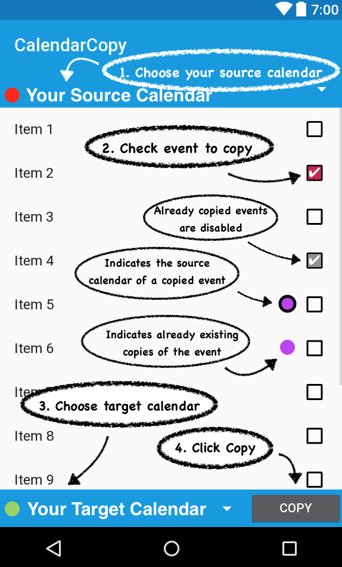

# CalendarCopy 


An Android application to copy calendar events from a calendar to another. Currently Android versions from *Jelly Bean* (4.2) to *Nougat* (7.1) are supported. 

It eases the management of events in case the user has to deal with a variety of shared (read-only) calendars where only a fraction of events is actually relevant.
The application keeps track of the copy history to a) prevent copying the same event over and over again and b) to provide an overview in case events NEED to be copied to multiple calendars.
It is NOT a full featured calendar app.
*CalendarCopy* will **NEVER** touch the original event or alter the content of a copied event.

## Installation

First, you should grant permissions to [install APKs from unknown sources](https://developer.android.com/distribute/marketing-tools/alternative-distribution.html#unknown-sources). Second, scan this QR code or head to the [release section](releases) and download the APK manually. Click on the downloaded file to initiate the installation process. 


Users familiar with *Android Studio* may copy this repository and build/install the APK themselves:

```
git clone https://github.com/aleneum/CalendarCopy.git
```

## Usage



## Feedback and Disclaimer

This is experimental software and has to be used with caution. Feedback is appreciated and can be provide by [opening issues](issues) for bug reports or feature requests and [pull requests](pulls).